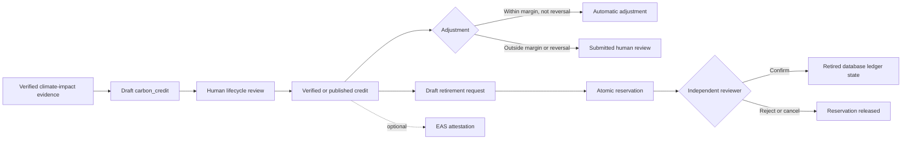

# dMRV Architecture

Digital Measurement, Reporting, and Verification (dMRV) architecture for
Kokonut Intelligence. The platform collects field, environmental, financial,
market, and blockchain evidence; stores governed records canonically in
PostgreSQL; mirrors selected high-volume events to ClickHouse; computes
advisory analytics; and exposes public outputs only through lifecycle,
evidence, registry, consent, and human-review gates.

dMRV is not one autonomous pipeline. It is a set of ingestion, evidence,
scoring, reporting, attestation, and approval paths with different guarantees.
The most important boundaries are:

- PostgreSQL is the canonical transactional and governance store.
- ClickHouse is an analytical/event mirror, not the lifecycle source of truth.
- Dual-write is used by selected telemetry and event pipelines, not every
  ingestion path.
- An anomaly, CRISP score, metric computation, or AI summary is not verification.
- EAS transaction submission is implemented, but is an explicit signing/write
  path rather than an automatic consequence of every measurement.
- Agents may draft permitted records but cannot verify or publish governed data.

## Status Vocabulary

| Status | Meaning |
|--------|---------|
| Implemented and scheduled | Executed by a configured Prefect deployment or worker schedule |
| Implemented but manual | Available through a CLI or service call, not automatically scheduled |
| Advisory | Produces analysis or a recommendation; does not establish verification |
| Optional on-chain path | Requires explicit signing, configuration, and transaction submission |
| Indexed/read-only | Reads external chain state into platform records |
| Schema-supported | Database structures exist, but no complete automated path is implied |

## Concept Map

| dMRV Concept | Platform Implementation | Status | Key Files |
|---|---|---|---|
| Automated data collection | Sensors, weather, climate, market, remote sensing, GIS, EAS, RPC, and governance indexers | Mixed scheduled/manual | `services/ingestion/` |
| Real-time or near-real-time monitoring | MQTT, HTTP sensor receiver, stream processing, alert rules, freshness checks | Implemented; deployment-dependent | `mqtt_subscriber.py`, `http_sensor_receiver.py`, `services/stream/` |
| Pattern detection | Prophet univariate and Isolation Forest multivariate anomaly detection | Advisory | `ml_anomaly_detector.py` |
| Rule-based alerts | Sensor thresholds, anomaly rules, webhooks, Directus notifications | Implemented | `anomaly_detector.py`, `alert_rule` |
| Blockchain indexing | EAS GraphQL, RPC, Gnosis, Baal, and subgraph indexers | Indexed/read-only | `services/ingestion/*indexer.py` |
| Blockchain attestation | EAS schema registration, attestation, multi-attestation, and revocation | Optional on-chain path | `services/attestation/` |
| Carbon accounting | Tree, soil, harvest, GHG, and climate-impact records | Implemented | `services/analytics/carbon_credits.py`, schemas |
| Carbon-credit issuance | Draft legacy `carbon_credit` or class/batch issuance records | Governed | `services/analytics/carbon_credits.py`, `services/credit_class/` |
| Risk assessment | Five-dimension CRISP scoring | Advisory | `services/crisp/` |
| Evidence scorecards | EBF pillar scoring and publication gates | Governed/advisory | `services/scoring/` |
| Workflow orchestration | Prefect flows and scheduled deployments | Implemented and scheduled | `services/flows/` |
| Reporting | 94 registered report generators and public-interest context | Implemented/manual | `services/export/report_generator.py` |
| Interoperability | CIDS JSON-LD, RDF triples, IRIs, metadata API | Implemented/manual | `services/registry/`, `services/rdf/`, `services/iri/` |

## Canonical Architecture

```mermaid
flowchart LR
    subgraph Sources
        S1[IoT MQTT / HTTP / CSV]
        S2[OpenWeatherMap]
        S3[World Bank / Yahoo Finance]
        S4[GEE / Copernicus]
        S5[EAS GraphQL]
        S6[RPC chains / Gnosis]
        S7[GIS and manual imports]
    end

    subgraph Ingestion
        I1[Sensor and weather ingesters]
        I2[Market and price ingesters]
        I3[Remote-sensing jobs]
        I4[EAS and RPC indexers]
        I5[Climate and GIS imports]
        I6[Retry, lineage, and ingestion logging]
    end

    subgraph PostgreSQL[PostgreSQL canonical governed store]
        P1[Observations and events]
        P2[Claims and metric values]
        P3[CRISP and EBF scorecards]
        P4[Attestations and schema metadata]
        P5[Credits, batches, retirements]
        P6[Lifecycle, review, evidence, lineage]
    end

    subgraph ClickHouse[ClickHouse analytical mirrors]
        C1[Telemetry and weather events]
        C2[Wallet and governance events]
        C3[Remote-sensing events]
        C4[Attestation events]
        C5[Materialized aggregates]
    end

    subgraph Analysis[Advisory and governed analytics]
        A1[Freshness and anomalies]
        A2[CRISP risk assessment]
        A3[EBF and metric scoring]
        A4[Reports and dashboards]
    end

    subgraph Publication[Human-reviewed publication paths]
        G1[Public PostgreSQL views]
        G2[CIDS / RDF / IRI exports]
        G3[EAS payload preparation]
        G4[EAS transaction publisher]
    end

    Sources --> Ingestion
    Ingestion --> PostgreSQL
    Ingestion -. selected dual-write .-> ClickHouse
    PostgreSQL --> Analysis
    ClickHouse --> Analysis
    Analysis --> Publication
    Publication --> G1
    Publication --> G2
    Publication --> G3 --> G4
```



## Ingestion Sources And Destinations

| Source | Implementation | Typical PostgreSQL destination | Mirror behavior |
|--------|----------------|-------------------------------|-----------------|
| OpenWeatherMap | `weather.py`, `weather_forecast.py` | Weather observations and forecasts | Selected weather mirrors |
| MQTT sensors | `mqtt_subscriber.py` | `sensor_reading`, ingestion logs | PostgreSQL plus ClickHouse telemetry |
| HTTP sensors | `http_sensor_receiver.py` | `sensor_reading`, device metadata | PostgreSQL plus ClickHouse telemetry |
| CSV/manual sensors | `sensor_ingester.py` | Sensor readings and calibration records | Selected telemetry mirrors |
| Google Earth Engine | `gee_remote_sensing.py`, `gee_climate.py` | Remote-sensing and climate tables | Remote-sensing paths mirror selected events |
| Copernicus Data Space | `copernicus_remote_sensing.py` | Remote-sensing observations | Selected remote-sensing mirrors |
| World Bank Pink Sheet | `market_data.py` | `price_observation` | Primarily PostgreSQL |
| Yahoo Finance | `yahoo_finance.py` | Market-price records and logs | Primarily PostgreSQL |
| EAS GraphQL | `eas_indexer.py` | `attestation_record` | ClickHouse attestation events |
| RPC providers | `rpc_indexer.py` | `wallet_activity_event` | ClickHouse wallet events |
| Gnosis contracts | `gnosis_indexer.py`, `baal_indexer.py` | Governance and treasury records | Selected governance mirrors |
| Legacy subgraph | `subgraph_indexer.py` | Indexed governance/treasury records | PostgreSQL and selected mirrors |
| GIS files | `gis_import.py`, shapefile/KML importers | Location, boundary, and zone records | Primarily PostgreSQL |
| Climate covariates | `climate_data.py`, `gee_climate.py` | Climate-model feature tables | Primarily PostgreSQL |

The ingestion package also contains device management, mock sensors, actuator
commands, adaptive sampling, price attestation, oracle aggregation, raster
metadata, status, and data-freshness modules.

### Dual-Write Boundary

Dual-write is common for high-volume telemetry, weather, remote sensing, EAS,
wallet, and selected governance events. It is not a package-wide invariant.
Market data, climate covariates, device configuration, freshness status, GIS
imports, price attestations, and several governance paths are primarily
PostgreSQL-backed.

ClickHouse failures may be logged as warnings without rolling back the
PostgreSQL operation. This is eventual consistency, not an atomic distributed
transaction.

## Retry, Lineage, And Observability

Shared ingestion behavior is defined in `services/ingestion/base.py` and
configuration modules:

- `INGESTION_MAX_RETRIES`, default `3`
- exponential backoff, default `2.0`
- jitter, default `0.5`
- retries limited to transient connection, timeout, OS, and PostgreSQL
  operational/interface failures
- permanent validation errors such as `ValueError` and `KeyError` are not
  retried

`ingestion_log` records source system, target table, operation, payload hash,
status, errors, row count, processing duration, and processor version.
`chain_indexer_status` tracks blockchain synchronization. Logging uses
`services.common.logging.get_logger`.

Available observability records and services include:

- `data_freshness_check`
- `sensor_device_health`
- `remote_sensing_job`
- `ingestion_log`
- `chain_indexer_status`
- sensor alerts
- Prefect retries and subprocess results
- health-check scripts and flows

These provide operational visibility but do not constitute a universal tracing
or distributed transaction system.

## Monitoring And Anomaly Detection

### Freshness

`data_freshness.py` reads source-specific thresholds, checks latest PostgreSQL
timestamps, writes freshness results, classifies data as `fresh`, `stale`,
`critical`, or `no_data`, and can send webhook or email alerts.

Tracked source families include weather, sensors, remote sensing, market data,
EAS, RPC, and Gnosis indexers.

### Rule-Based Detection

`anomaly_detector.py` evaluates sensor rules, creates `sensor_alert` records,
can create MRV claims, and can notify Directus or alert channels. Actuation
paths remain subject to approval and safety controls.

### ML Detection

`ml_anomaly_detector.py` provides:

- Prophet univariate seasonal detection
- Isolation Forest multivariate detection
- model persistence
- minimum-data checks
- CLI-triggered training and checks

These outputs are advisory monitoring evidence. They do not verify metrics,
claims, credits, or attestations.

## Climate And Remote Sensing Automation

- `climate_data.py` refreshes climate covariates for active locations.
- `remote_sensing_fetcher.py` claims due jobs with `FOR UPDATE SKIP LOCKED`.
- Jobs record provider, cadence, status, attempts, and next-run information.
- Providers include Google Earth Engine and Copernicus.
- The six-hour deployment triggers the fetch flow, but each job's cadence and
  due state determine whether a location is fetched.
- Fetch failures update job state and schedule a later attempt; they are not a
  universal dead-letter workflow.

## EAS And Blockchain Architecture

### EAS Client Chains

The attestation client supports:

| Chain | Chain ID | Role |
|-------|----------|------|
| Celo | 42220 | Default and primary evidence chain |
| Celo Alfajores | 44787 | Test network support |
| Optimism | 10 | Attestation client support |
| Base | 8453 | Attestation client support |

The EAS indexer currently indexes Celo, Optimism, and Base, not Alfajores.

The general RPC configuration additionally supports Ethereum, Arbitrum, Celo,
Celo Alfajores, Gnosis, Optimism, and Base. EAS client support and RPC/indexer
support are separate inventories.

### Publishing And Indexing

The attestation package implements both read and write paths:

- schema registration
- schema lookup
- attestation and multi-attestation
- revocation
- on-chain retrieval
- EAS indexing through GraphQL

Relevant files include `eas_client.py`, `publisher.py`, `signer.py`, `payload.py`,
and `cli.py`. Transaction submission requires explicit signer configuration,
including `ATTESTER_PRIVATE_KEY`, RPC access, schema configuration, and human or
operator authorization as appropriate.

`payload.py` prepares public-safe data and stores hashes/CIDs rather than private
evidence bodies. `publisher.py` and `eas_client.py` perform the actual
transaction path. An indexed attestation is evidence of a chain record; it does
not by itself prove the underlying measurement is correct.

## Evidence, Metrics, And Scoring

### Measurement To Evidence

```text
sensor / field / remote sensing / external data
        ↓
canonical PostgreSQL observation or event
        ↓
metric computation or claim preparation
        ↓
draft, unverified governed output
        ↓ human review
verified / published public output
        ↓ optional
EAS attestation and interoperability export
```

Metric computation creates draft, unverified `metric_value` rows. A human must
verify individual values before public metric views expose them.

### CRISP

CRISP is a five-dimensional risk engine, not an independent verification
service:

| Dimension | Weight | Evidence |
|-----------|--------|----------|
| Carbon Yield | 40% | Trees, soil carbon, harvest, remote sensing, benchmarks |
| Climate | 25% | Weather, emergency incidents, mitigation records |
| Policy | 15% | Certification, adoption barriers, land stewardship, inclusion |
| Financial | 10% | Sustainability plans, unit economics, revenue, expenses |
| Implementation | 10% | Onboarding, regenerative practice, training, feedback |

CRISP computes risk scores, confidence, and AAA–D bands and persists
assessments as draft records. It is surfaced in reports and situation
assessment; it does not verify claims or publish credits.

### EBF And Scoring

`services/scoring/` implements EBF pillar calculations, trust/evidence context,
and publication gates. CRISP and EBF share evidence and reporting infrastructure
but remain separate scoring systems:

```text
evidence ──> CRISP risk assessment
       └───> EBF scorecard and publication gates

CRISP ──> risk findings, situation context, backcasting alignment
EBF ───> evidence maturity and public claim eligibility
```

## Carbon And Credit Lifecycle

### Legacy Carbon Credits



`issue_credit()` reads a verified or published climate-impact summary, applies
the configured buffer pool, and creates a `carbon_credit` in `draft`. It does
not itself publish, mint, or attest the credit.

`adjust_credit()` automatically handles eligible within-margin, non-reversal
changes. Out-of-margin changes and reversals require review and are not
automatically published.

`retire_credit()` locks the credit, reserves quantity, and creates a draft
retirement with an idempotency key. `review_retirement()` requires a separate
reviewer and confirms, rejects, or cancels the request. Ordinary retirement
stops at governed database state; optional attestation and transaction fields
are not evidence that a chain transaction occurred.

### Credit Class And Batch Hierarchy

```text
credit_type
    └── credit_class
           └── credit_batch
                  ├── credit_balance
                  ├── marketplace orders
                  ├── bridge transactions
                  └── carbon_credit legacy identity
```

Classes define methodology, registry, program, protocol, issuer, and buffer-pool
metadata. Batches define vintage, quantity, evidence, chain, and issued/retired/
cancelled quantities. Issuance requires a verified batch and authorized,
non-revoked issuer. This newer hierarchy coexists with the legacy
`carbon_credit` flow and is not interchangeable with an attestation record.

### Publication Gates

Published legacy carbon credits require:

- evidence maturity exactly 6;
- an external verifier;
- a methodology reference;
- a verified or published farm registry for public views.

Public carbon scoring additionally requires a published third-party verified
carbon impact claim, evidence link, verifier, and methodology reference. Public
claims are not unlocked merely because a model or attestation exists.

## Prefect Orchestration

Deployment configuration: `config/prefect/deployment.yaml`.

| Deployment | UTC schedule | Flow | Actual work |
|------------|--------------|------|-------------|
| `scheduled-hourly` | `0 * * * *` | `scheduled_hourly` | Sensor ingestion, anomaly detection, freshness check |
| `scheduled-every-6h` | `0 */6 * * *` | `scheduled_every_6h` | Weather, dashboard refresh, remote-sensing flow |
| `scheduled-daily` | `0 6 * * *` | `scheduled_daily` | Market data, metrics, credit adjustment |
| `scheduled-weekly` | `0 3 * * 0` | `scheduled_weekly` | Climate data refresh only |
| `full-pipeline` | Manual | `full_pipeline` | Ingestion → monitoring → analytics → remote sensing |

Named flows also include sensor ingestion, weather ingestion, market data,
EAS indexing, RPC indexing, Gnosis indexing, remote-sensing fetch, anomaly
detection, metrics computation, dashboard refresh, freshness checks, climate
refresh, credit adjustment, health check, and price-feed ingestion.

The weekly flow does not invoke ML model retraining, despite stale wording in a
flow docstring. Remote-sensing execution is due-job based, so a six-hour trigger
does not guarantee a fetch for every location.

## Reporting And Interoperability

The report registry currently contains 94 report types. `--auto` executes the
registered generators for the selected location or network scope; it does not
automatically mean every location unless the CLI scope requests that behavior.

Report families include farm, crop, climate, financial, CRISP, EBF, governance,
regenerative, ecological, organic, stakeholder, process-health, business
architecture, strategic reserve, tactical, simulation, capital accounting,
state-of-Kokonut, and data-stream outputs.

### CIDS

`services/registry/cids_export.py` implements CIDS v3.2.0 Essential Tier JSON-LD.
It is a compatibility/export mapping over canonical PostgreSQL records, not a
replacement schema.

### RDF, IRI, And Metadata

The platform supports:

- RDF graph building and persisted `rdf_triple` records
- named graphs and Turtle, N-Triples, and JSON-LD serialization
- bounded SPARQL-to-SQL queries
- deterministic `kokonut:{entity_type}:{entity_id}:v{version}` IRIs
- IRI history and optional anchoring
- metadata graph resolution and generation

Relevant packages are `services/rdf/`, `services/iri/`, and
`services/metadata_api/`.

## Public Views And Agent Boundaries

Public views generally require the applicable combination of:

- `verified` or `published` lifecycle status;
- evidence maturity and evidence links;
- active location;
- verified or published farm registry;
- public consent or privacy metadata;
- carbon-specific verifier and methodology gates.

Directus hooks, database constraints, and `services/agents/safety.py` enforce
different parts of this boundary. Agents may draft or submit permitted outputs,
but cannot directly verify or publish governed records. Human approval remains
required for publication, attestation, retirement confirmation, and other
high-risk actions.

## Design Principles

1. **Canonical storage:** PostgreSQL and Directus remain authoritative for
   governed records and lifecycle state.
2. **Analytical separation:** ClickHouse mirrors selected events and may lag or
   fail independently; it is not the governance source of truth.
3. **Evidence before publication:** Computed and modelled outputs begin as
   drafts and require appropriate human verification.
4. **Explicit chain writes:** EAS publishing and revocation require explicit
   signer, RPC, schema, and authorization configuration.
5. **Human approval:** Agents can summarize and draft but cannot verify, publish,
   confirm retirement, or execute high-risk actions autonomously.
6. **Advisory analytics:** CRISP, EBF, anomaly detection, forecasts, and
   situation assessments inform review; they do not substitute for it.
7. **Bounded interoperability:** CIDS, RDF, IRI, and metadata exports expose
   governed records without replacing canonical PostgreSQL storage.
8. **Configurable operations:** Weights, thresholds, cadences, retries, and
   provider settings are configurable where the owning service supports them.

## Tests And Limitations

Architecture-relevant tests include:

- `tests/test_attestation.py`
- `tests/test_carbon_credits.py`
- `tests/test_ebf_carbon_gates.py`
- `tests/test_ebf_scoring.py`
- `tests/test_crisp_scoring.py`
- `tests/test_prefect_workflow.py`
- `tests/test_telemetry_freshness.py`
- `tests/test_ml_anomaly.py`
- `tests/test_climate_data.py`
- `tests/test_remote_sensing_automation.py`
- `tests/test_cids_export.py`
- `tests/test_linked_data.py`
- `tests/test_agent_safety.py`
- `tests/test_platform_done.py`
- `tests/test_oracle_infrastructure.py`

Important limitations:

- Prefect tests are primarily structural and do not execute every production
  schedule against live providers.
- ClickHouse mirroring is not atomic with PostgreSQL writes.
- External provider availability, credentials, rate limits, and data quality
  affect ingestion completeness.
- Anomaly detection and risk scoring are advisory.
- EAS payload preparation and EAS transaction submission are separate steps.
- A database attestation record or UID does not independently validate the
  underlying private evidence.
- Legacy and class/batch credit models coexist and require explicit mapping.
- Public views can exclude records that are otherwise present internally because
  of lifecycle, evidence, consent, registry, or privacy gates.

## Source References

- `services/ingestion/` — source adapters, indexers, freshness, and anomalies
- `services/attestation/` — EAS schemas, payloads, signer, publisher, CLI
- `services/analytics/carbon_credits.py` — legacy carbon-credit lifecycle
- `services/credit_class/` — class, batch, balance, marketplace, bridge flows
- `services/crisp/` — CRISP risk scoring
- `services/scoring/` — EBF scoring and publication gates
- `services/flows/` — Prefect flows
- `config/prefect/deployment.yaml` — deployment schedules
- `services/export/report_generator.py` — report registry and public context
- `services/registry/cids_export.py` — CIDS export
- `services/rdf/`, `services/iri/`, `services/metadata_api/` — linked-data paths
- `services/agents/safety.py` — agent write and publication boundaries
- `schemas/postgres/` — canonical PostgreSQL schemas and constraints
- `schemas/clickhouse/` — analytical schemas and materialized views
