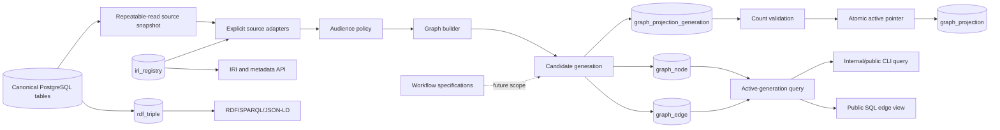

# Evidence Lineage Graph

The evidence-lineage graph is a generation-backed PostgreSQL read model. It
projects explicit, policy-filtered relationships from canonical PostgreSQL
records into `graph_node` and `graph_edge`. PostgreSQL and Directus records
remain authoritative. RDF triples, IRIs, and the metadata API are separate
interoperability/read models.

The projection is designed for bounded evidence lineage and provenance queries,
not as a general graph database, automatic evidence verifier, or replacement for
the RDF graph.

## Architecture



Important boundaries:

- `iri_registry` is read-only input to the projection; the projection does not
  create or update IRIs.
- `rdf_triple` is populated by the separate RDF system; graph projection does
  not write RDF triples.
- The metadata API resolves IRIs and does not query graph projection tables.
- Workflow specifications currently do not govern graph rebuilds; lineage
  rebuild is listed as future workflow scope.

## Scope And Source Admission

Projection version 1 admits only explicit or conservatively validated sources:

| Source | Admission rule |
|--------|----------------|
| `location` | Rows with `updated_at <= cutoff` |
| `farm_registry_record` | Status `verified` or `published`, within cutoff |
| `metric_definition` | Rows within cutoff |
| `metric_value` | Rows with `computed_at <= cutoff`; public candidate policy applied |
| `impact_claim` | Rows within cutoff; claim publication policy applied |
| `attestation_record` | Published, non-revoked, non-expired, globally unique UID, within cutoff |
| `attestation_schema` | Only schemas referenced by admitted attestations |
| `iri_registry` | Current IRIs for allowlisted entity types |

Allowlisted IRI entity types are:

```text
location
farm_registry_record
metric_definition
metric_value
impact_claim
attestation_record
attestation_schema
```

The source cutoff applies to the canonical source queries. Current IRI lookup
selects `is_current = TRUE` IRIs at the transaction snapshot and does not apply
the source cutoff in the same way.

The projection deliberately excludes untyped `source_record_ids`, inferred
claim-to-metric-value links, report JSON parsing, private evidence bodies,
reviewer UUIDs without explicit foreign keys, external-verifier relationships,
stakeholder-outcome relationships, and RDF-only relationships.

## Graph Vocabulary

### Node Types

Registered node types in `schemas/postgres/173_typed_temporal_graph.sql`:

| Node type | Typical entity |
|-----------|----------------|
| `entity` | Generic entity node |
| `registry_record` | Farm registry record |
| `metric_definition` | Metric definition |
| `metric_value` | Computed metric value |
| `impact_claim` | Impact claim |
| `evidence_reference` | Synthetic CID or hash evidence node |
| `attestation` | Attestation record |
| `attestation_schema` | Attestation schema |

### Entity Types

The builder produces entity keys for:

```text
location
farm_registry_record
metric_definition
metric_value
impact_claim
attestation_record
attestation_schema
```

Entity type and node type are separate fields. Synthetic evidence nodes receive
`evidence_cid` or `evidence_hash` entity keys and do not receive IRI lookups.

### Edge Types

The allowlisted edge vocabulary is:

| Edge type | Relationship |
|-----------|--------------|
| `registers` | Registry record registers a location |
| `measures` | Metric value measures a metric definition |
| `about_location` | Record is about a location |
| `claims_metric` | Impact claim references a metric definition |
| `supported_by` | Claim or output is supported by evidence |
| `uses_schema` | Attestation uses an attestation schema |
| `attests` | Attestation attests a subject or claim |

Claims do not receive inferred edges to metric values. Claims may link to
attestations by `attestation_uid`, with `attributes.join_basis` set to
`attestation_uid`.

## Audience Policy

The builder computes audience from canonical state; callers cannot assign a
projection audience.

### Public Eligibility

- Registry records are public when status is `verified` or `published`.
- Metric values are public only when verified, the newest verified value for the
  metric/location, and the location is eligible.
- Impact claims require an active eligible location, published status,
  `public_claim = TRUE`, maturity at least 4, and no expiration. Carbon claims
  additionally require maturity 6, `third_party_verified_claim`, external
  verifier, and methodology reference.
- Attestations require published status, Celo chain, no revocation, no temporal
  expiry, and an eligible location.

The schema permits node and edge audiences `private`, `internal`, and `public`.
The Python builder, validator, and query path currently emit and accept only
`internal` and `public`. `private` is schema-supported but not currently
produced or queryable by the projection package.

`audience=internal` includes both internal and public records. It is not a
private-only view.

## Generation Lifecycle

`services.graph_projection.rebuild` performs:

1. Require a nonblank actor.
2. Select a UTC source cutoff.
3. Open a `REPEATABLE READ` transaction.
4. Apply `statement_timeout = 120s` and `lock_timeout = 10s`.
5. Acquire a transaction-scoped advisory lock using the projection namespace.
6. Insert a `building` generation.
7. Load admitted sources and build candidate nodes and edges.
8. Set generated `valid_from` to the source cutoff and leave `valid_to` null.
9. Validate generated rows.
10. Persist nodes and edges and verify their counts.
11. Compute a deterministic content hash from sorted source hashes.
12. Mark the previous active generation `superseded`.
13. Mark the candidate generation `active`.
14. Update the `graph_projection` active-generation pointer.
15. Commit the transaction.

On failure, the connection rolls back and the exception is propagated. Because
the candidate is inserted in the same transaction, the failed candidate is not
retained as an operator-visible `failed` generation. The schema permits a
`failed` status, but the current implementation does not persist it.

The content hash is not a serialized hash of persisted graph rows. It is derived
from sorted node and edge source hashes. It is stable across unchanged inputs
and policy state, but can change when time-sensitive audience policy changes.

## Temporal Validity

Rebuild-generated nodes and edges receive:

```text
valid_from = source cutoff
valid_to   = NULL
```

The public SQL view checks current validity for the edge and both endpoint nodes.
General CLI traversal joins the active generation but does **not** filter
`valid_from` or `valid_to`. The public SQL boundary and general query behavior
are therefore not equivalent.

## CLI Reference

```bash
python3 -m services.graph_projection rebuild --actor OPERATOR
python3 -m services.graph_projection status
python3 -m services.graph_projection validate
python3 -m services.graph_projection validate --generation-id GENERATION_UUID
python3 -m services.graph_projection query \
  --entity-key location:UUID \
  --depth 2 \
  --node-cap 100 \
  --edge-type about_location \
  --location-id LOCATION_UUID \
  --audience internal
```

`--edge-type` is repeatable. If omitted, all seven registered edge types are
used. Query arguments:

| Argument | Default | Bounds or values |
|----------|---------|------------------|
| `--depth` | `1` | Integer `0` through `5` |
| `--node-cap` | `100` | Integer `1` through `500` |
| `--audience` | `internal` | `internal` or `public` |
| `--location-id` | none | Optional UUID scope |
| `--edge-type` | all types | Repeatable allowlisted edge type |

Each query sets a five-second statement timeout.

## Traversal Semantics

Traversal is bidirectional: an edge can expand from either its source or target
endpoint. It reads only the active generation.

The maximum depth is 5 and maximum returned node cap is 500, but the node cap is
applied after recursive expansion. It limits the final returned node IDs; it
does not cap recursive work during the walk. The returned nodes are ordered by
minimum discovered depth and then UUID. Returned edges include only edges whose
source and target nodes are both in the selected node set.

Location filtering applies independently to nodes and edges with matching
`location_id`; it is not a graph-wide location join. Public queries consider only
public nodes and edges. Internal queries consider both internal and public rows.

## Status Command

`status` reports the active projection pointer, including:

- `projection_key`
- `projection_version`
- active generation ID
- generation status
- source cutoff
- node count
- edge count
- content hash

If the projection definition is absent, status returns a `missing` result. It
does not list historical generations or persisted failure records.

## Validate Command

`validate` uses the active generation unless `--generation-id` is supplied. It
returns invalid when no active generation exists and otherwise checks that stored
node and edge counts match actual row counts.

It does not recompute the content hash or verify:

- active-pointer consistency;
- node and edge references;
- registered node/edge types;
- audience values;
- temporal ranges;
- public-view gates;
- canonical source consistency.

Rebuild-time generated-row validation is stronger than the public `validate`
command. Do not interpret a valid count check as complete lineage integrity
verification.

## Public SQL View

`v_public_evidence_lineage_edge` is the public database boundary. It reads only
the active generation and requires:

- generation status `active`;
- public edge;
- public source and target nodes;
- current edge and endpoint temporal validity;
- active location;
- verified or published registry eligibility for the edge location.

The view returns only:

```text
id
edge_type
source_node_id
location_id
valid_from
valid_to
source_hash
attributes
```

It does not expose entity keys, IRIs, source tables, or audience fields and is
not a complete public graph-document endpoint.

## RDF, IRI, And Metadata Boundaries

The projection reads current IRIs from `iri_registry` but does not create,
update, or version them. The IRI system maintains deterministic identifiers,
content hashes, previous versions, and current pointers.

RDF is persisted independently in `rdf_triple` and supports broader graphs,
serialization, and SPARQL-to-SQL behavior. No code path synchronizes
`graph_node`/`graph_edge` with `rdf_triple`.

The metadata API resolves IRIs and returns JSON-LD-like metadata. It does not
query graph projection tables or expose lineage traversal.

These are parallel read models:

```text
canonical PostgreSQL → graph projection → bounded lineage query
canonical PostgreSQL → RDF triples → RDF/SPARQL/JSON-LD
canonical PostgreSQL → IRI registry → metadata API
```

## Workflow And Tests

No evidence-lineage workflow specification currently exists in
`services/workflow_specs/`. Workflow documentation lists rebuild and activation
fault boundaries as follow-on scope.

`tests/test_graph_projection.py` covers transaction ordering, rollback,
conservative public policy, read-only IRI lookup, input bounds, active-generation
filtering, and query timeout. It does not fully cover:

- PostgreSQL schema integration;
- public SQL view behavior;
- temporal validity;
- content-hash verification;
- persisted node/edge contents;
- type-registration triggers;
- location filtering;
- recursive expansion before node caps;
- complete source-adapter admission;
- real rebuild idempotency.

## Source References

- `schemas/postgres/173_typed_temporal_graph.sql`
- `services/graph_projection/evidence_lineage.py`
- `services/graph_projection/kernel.py`
- `services/graph_projection/policy.py`
- `services/graph_projection/query.py`
- `services/graph_projection/cli.py`
- `services/iri/`
- `services/rdf/`
- `services/metadata_api/`
- `tests/test_graph_projection.py`
- `docs/workflow-specifications.md`
